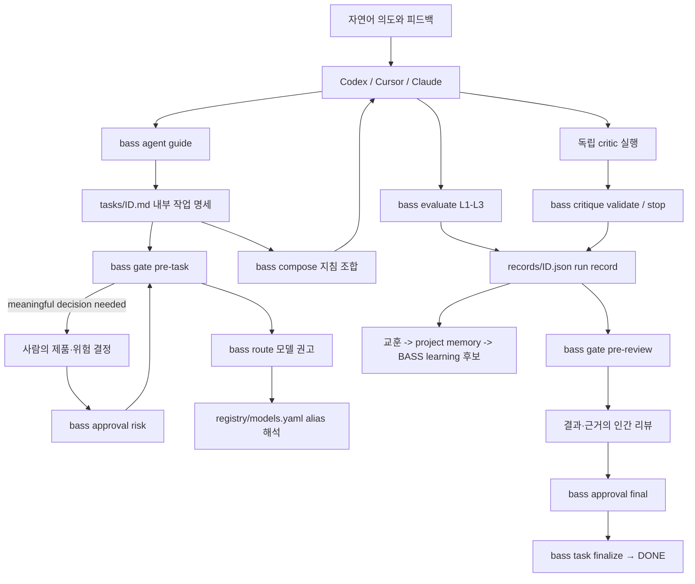

# Architecture

## 핵심 결정: BASS 는 자문·감독 런타임이다

BASS 는 LLM API 를 직접 호출하지 않는다. 실행 주체는 Codex / Cursor / Claude
세션이며, BASS 는 그 세션들이 따라야 할 규칙·게이트·권고를 제공한다.
COL 의 `harness.py pre-task / pre-complete` 패턴을 일반화한 것이다.

사람의 인터페이스는 AI 도구와의 자연어 대화다. BASS CLI는 AI 에이전트가 내부적으로
호출하는 실행 API이며, 상태·승인 파일·run record를 사람이 직접 관리하는 운영 UI가 아니다.
`bass agent guide`가 현재 프로젝트와 task에 맞는 동적 실행 계약을 제공한다.

이 결정의 이유:

- 세 에이전트 채널 모두 자체 실행 루프를 가진다. BASS 가 실행까지 소유하면
  채널별 API 통합 비용이 커지고 하네스 자체가 목적이 되는 위험(§29)이 커진다.
- 게이트·검증·기록은 채널과 무관하게 동일해야 하는 부분이고, 그것이 BASS 의 가치다.

## 구성 요소

| 프롬프트 §5 요구 | 구현 |
|------------------|------|
| Core Runtime | `src/` 전체 + `bass` CLI |
| Model Registry | `registry/models.yaml` + `src/registry/` |
| Model Router | `src/router/` — 위험·capability 기반 권고 |
| Policy Engine | `policies/approval.yaml` + `src/policy/` |
| Workflow Engine | `src/workflow/` — 상태 머신 + 게이트 |
| Prompt/Instruction Composer | `prompt-library/` + `src/compose/` |
| Project Profiles | `profiles/*.yaml` |
| Evaluators | `src/evaluators/` — 프로젝트 선언 명령 위임 실행 |
| Subagent Orchestrator | host agent 실행 계약 + critic 프로토콜 (`src/agent/`, `src/critics/`, `prompt-library/critics/`) |
| Human Approval Gates | 위험 결정 기록, `pre-review`, 최종 승인, `task finalize` |
| Memory and Learning | run record 의 lessons + 디자인 교정 pending 루프 |
| Observability | run record (`records/<id>.json`) — 모델·검증·finding·승인 기록 |
| CLI | `src/cli/main.ts` |

## 데이터 흐름



## 버전 정책 분리 (§7)

- **중앙 레지스트리 (빠른 변경)**: `registry/models.yaml` — 모델 식별자, stable/candidate, fallback.
  이 파일만 갱신하면 모든 프로젝트에 반영된다.
- **버전 고정 동작 (느린 변경)**: `policies/`, `prompt-library/`, `src/` 의 상태 전이·게이트·
  finding 스키마. 변경 시 bass-platform 버전을 올리고, 프로젝트는 `bass.yaml` 의
  `bass.version` 으로 특정 버전에 의존한다.

### CLI 전달 경계

- 런타임 전달물은 `npm pack`으로 생성한 tarball이며 source, tests, examples를
  포함하지 않는다.
- 소비 프로젝트의 package manager 설치는 실행 파일과 dependencies를 전달하고,
  `bass.yaml`은 허용된 런타임 버전을 선언한다. 두 역할은 대체 관계가 아니다.
- 0.x에서는 exact version 일치를 강제한다. package registry와 publish 권한이
  결정되기 전에는 `private` package와 로컬 tarball 설치를 사용한다.
- `npm run smoke:package`는 격리 프로젝트에 실제 tarball과 런타임 dependencies를
  오프라인 설치해 CLI, init, config, version mismatch를 검증한다.

## 프로젝트 통합 (§6, Design §8)

기존 프로젝트 연결도 일반 BASS 작업과 같은 Observe → Understand → Plan → Implement
→ Verify → Review 루프를 따른다. BASS는 별도의 마이그레이션 엔진이 아니며, 호스트
에이전트가 프로젝트를 조사해 package, 설정과 얇은 shim만 최소 침습적으로 연결한다.
기존 규칙·검증·이력은 프로젝트 원천으로 유지하고, 겹치는 체계는 통합해 두 번째
Single Source of Truth를 만들지 않는다.

```text
project/
├── bass.yaml          # 유일한 실질 설정. 프로파일과 alias 만 참조
├── AGENTS.md          # Codex shim (참조만, bass-shim 마커)
├── .cursor/rules/bass.mdc  # Cursor shim
├── CLAUDE.md          # Claude shim
├── DESIGN.md          # UI 프로젝트의 디자인 명세 (선택)
├── tasks/             # 작업 명세
├── records/           # run record
├── critiques/         # critic finding
└── design/corrections.yaml  # 디자인 교정 pending 루프
```

shim 드리프트는 `bass doctor` 가 감시한다 (마커 부재, 비대화).
구체적인 조사·통합·파일럿·학습 승격 기준은
[기존 프로젝트 연결 방법론](adopting-existing-project.md)을 따른다.
